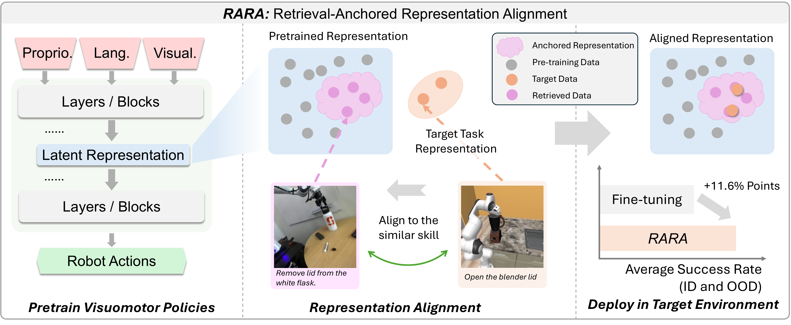

# RARA: Retrieval-Anchored Representation Alignment

RARA adapts a pre-trained robot policy to a new task by retrieving the related part of its pre-training data and
keeping the policy's visual representation aligned to it during fine-tuning.

<p align="center"></p>

## Quick start

**1. Install** the training environment and RoboTwin 2.0 (details in [INSTALL.md](INSTALL.md)):

```bash
git clone https://github.com/Shua-Kang/RARA.git && cd RARA
uv venv .venv --python 3.10
uv pip install -p .venv -r requirements.txt --extra-index-url https://download.pytorch.org/whl/cu121
# then RoboTwin 2.0 next to this folder: see INSTALL.md
```

**2. Download** data and checkpoints from Hugging Face:

```bash
bash scripts/download.sh            # pill demos, retrieved pre-training data, all checkpoints
```

**3. Evaluate the released checkpoints** (2 seed blocks x 25 episodes each):

```bash
for m in ft coft rara; do
  for s in 100000 200000; do CKPT=data/weights/$m.pt SPLIT=id SEEDSTART=$s TAG=${m}_id_$s bash scripts/eval.sh; done
done
for m in ft coft rara; do python scripts/summarize.py eval_out "${m}_id_*"; done
```

**4. Train** from the pre-trained policy:

```bash
MODE=ft   bash scripts/train.sh          # FT
MODE=coft bash scripts/train.sh          # Co-FT
bash scripts/stage1.sh                   # RARA, stage 1: align the encoder to the retrieved data
MODE=rara bash scripts/train.sh          # RARA, stage 2: fine-tune with the anchor to the pre-trained policy
bash scripts/evaluate.sh runs/pill_rara_s42 id     # last 3 checkpoints x 2 seed blocks x 25 episodes
```

**5. Pre-train** (optional; the pre-trained policy is part of the download):

```bash
bash scripts/download.sh pretrain        # 2000-demonstration pre-training set (77 GB)
MODE=pretrain bash scripts/train.sh      # 60 epochs, batch 256; 4 GPUs recommended, ~160 GB host RAM
```

Use `SPLIT=ood` in `scripts/eval.sh` for the wider object-position setting (`robotwin/task_config/eval_ood.yml`).

## Expected results

Success rate (%) on move pill bottle to pad, demonstration configuration, `scripts/evaluate.sh` protocol
(last three checkpoints x 2 seed blocks x 25 episodes = 150 rollouts per method):

| FT | Co-FT | RARA |
|---|---|---|
| 44.0 | 44.7 | **59.3** |

## Data and checkpoints

| | Hugging Face |
|---|---|
| Pill demonstrations (50) + retrieved pre-training episodes (250) | [`ShuaKang/robotwin_pill_rara`](https://huggingface.co/datasets/ShuaKang/robotwin_pill_rara) |
| Pre-training set (2000 demonstrations, 5 tasks) | [`ShuaKang/my_roboTwin2.0_training`](https://huggingface.co/datasets/ShuaKang/my_roboTwin2.0_training) (`dp_zarr_ws/`) |
| Pre-trained policy | [`ShuaKang/RARA-robotwin-pretrain`](https://huggingface.co/ShuaKang/RARA-robotwin-pretrain) |
| Fine-tuned policies (FT, Co-FT, RARA) | [`ShuaKang/RARA-robotwin-pill`](https://huggingface.co/ShuaKang/RARA-robotwin-pill) |

The retrieved set keeps the pick-and-place episodes of the pre-training data (task filter) and, among them, the 250
whose grasp-relative end-effector trajectories are closest to the pill demonstrations under dynamic time warping.

## Acknowledgements

Built on [RoboTwin 2.0](https://github.com/RoboTwin-Platform/RoboTwin) and
[Diffusion Policy](https://github.com/real-stanford/diffusion_policy).
